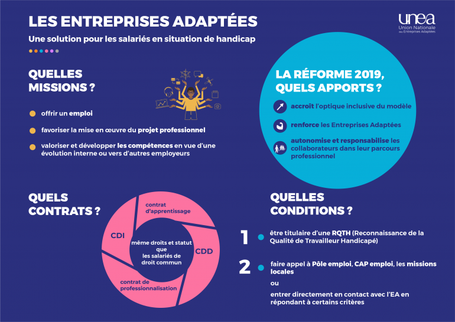

# ♿ Contrat en Entreprise Adaptée

## Qu'est ce qu'une Entreprise Adaptée ?



Les entreprises adaptées \(EA\) et entreprises adaptées de travail temporaire \(EATT\) permettent à leurs salariés d'exercer une activité professionnelle dans un environnement adapté à leurs possibilités, afin qu'ils obtiennent ou conservent un emploi. 

Les Entreprises Adaptées mettent en œuvre pour leurs salariés un accompagnement spécifique destiné à favoriser la réalisation de leur projet professionnel, la valorisation de leurs compétences et leur mobilité au sein de l'entreprise elle-même ou vers d'autres entreprises.

## 2 modes de recrutement pour les EA/EATT: 

**1️⃣** Le recrutement par le biais du SPE \(Service Public de l’Emploi\)

2️⃣ Le recrutement direct 


_Les orienteurs et autres prescripteurs habilités IAE peuvent orienter des candidats aux EA sur les Emplois de l’inclusion mais ces recrutements seront considérés comme des “recrutements directs”._ 


### Qui peut intégrer une entreprise adaptée  ?  

Pour intégrer une EA/EATT, le candidat doit avoir : 

* une RQTH 
* et répondre à un des critères en fonction du mode de recrutement 

### **1️⃣ Critères d'éligibilité EA/EATT dans le cadre d'un recrutement via le SPE** \*

\*Service Public de l'Emploi = Cap emploi, Mission Locale, Pôle emploi

* **Sans emploi depuis au moins 24 mois discontinus, dans les 48 derniers mois**
* Niveau infra V ou V Peu ou pas qualifié+ Sans diplôme,
* **Bénéficiaires de minimas sociaux** \(prioritairement bénéficiaires de l'allocation adulte handicapé \(AAH\),
* **Sortants d’un établissement ou service d’aide par le travail \(ESAT\)**,
* **Sortants d'ULIS PRO ou d'apprentissage adapté,**
* **Autres situations résultant de l'expertise technique du SPE** \(notamment changement d'EA, sortant d'un établissement de santé, …\).
* Autres situations résultants de l’expertise technique du SPE
* Licenciés pour inaptitude avec un projet pro hors EA 


#### Focus sur les bénéficiaires de minima sociaux : 

* allocation supplémentaire d'invalidité \(ASI\)
* allocation de solidarité spécifique \(ASS\)
* Allocation demandeurs d’asile \(ADA\)
* allocation temporaire d'attente \(ATA\)
* allocation veuvage \(AV\)
* Revenu de solidarité outre-mer \(RSO\)
* Revenu de Solidarité active \(RSA\)
* allocation adulte handicapé \(AAH\)

Source : [instruction DGEFP du 21/02/2019](https://www.legifrance.gouv.fr/circulaire/id/44443)


### 2️⃣ **Critères d'éligibilité EA/EATT dans le cadre d'un recrutement direct**

* Bénéficiaires de l'allocation adulte handicapé \(AAH\)
* Sans emploi depuis au moins 24 mois continus ou discontinus, dans les 48 derniers mois
* Sortants d’un établissement ou service d’aide par le travail \(ESAT\)
* Sortants d'un centre de rééducation professionnelle \(CRP\)
* Sortants d'ULIS PRO
* Sortants d'apprentissage adapté
* Sortants d'institution ou service spécialisé \(IME, IEM, IMPRO, d’un service d’accompagnement médico- social pour adultes handicapés \(SAMSAH\) et Service d'accompagnement à la vie sociale \(SAVS\) avec un projet professionnel à consolider
* Ayant bénéficié d’un contrat d'apprentissage réalisé dans une Entreprise Adaptée
* Plus de 55 ans
* Bénéficiaire d’une pension d’invalidité catégorie 1 ou 2


👉 Plus d’informations sur les missions des EA/EATT [sur le site de l’UNEA.](https://www.unea.fr/quest-ce-quune-entreprise-adaptee)


EXPERIMENTATIONS CDD TREMPLIN ET EATT   

* Titulaire d’une RQTH
* Demandeur d’emploi \(= sans emploi, pas forcément inscrit à Pôle Emploi\)

_\* Pour les postes non aidés, la RQTH n'est pas obligatoire_  

