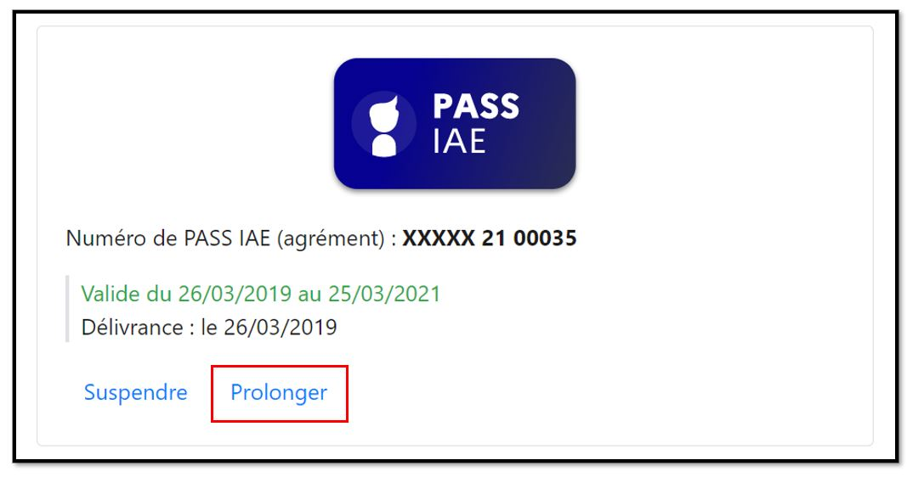

# Prolonger un agrément

Pour le moment, seuls les agréments qui ont été initialement délivrés par Pôle emploi sont concernés par les demandes de prolongation

Les prolongations peuvent être envisagées pour : 

* des personnes âgées de 50 ans et plus 
* des bénéficiaires d'une RQTH
* des personnes rencontrant des difficultés particulièrement importantes en ACI et en AI


L'enregistrement de la prolongation est **possible dès le 3ème mois qui précède la fin d'un agrément et jusqu'au dernier jour de validité d'un agrément.** 

Si l'agrément  est expiré il ne sera plus possible de demander une prolongation.


Si vous souhaitez prolonger un agrément, **vous devez obtenir l'accord d'un conseiller Pôle emploi inscrit sur les emplois de l'inclusion.** 

## Procédure pour demander l'autorisation de prolongation d'agrément à Pôle emploi : 

▪ L'employeur transmet à Pôle emploi un bilan de parcours du salarié et les actions envisagées pour la suite du parcours 

▪ En parallèle, l'employeur enregistre la demande de prolongation depuis son tableau de bord [\[ Voir mode d'emploi \]](prolonger-un-pass-iae.md#mode-demploi-pour-enregistrer-une-demande-de-prolongation-en-ligne)

▪ Le conseiller Pôle emploi réalise un entretien avec le salarié en insertion \(bilan du parcours IAE et diagnostic de la situation socio-professionnelle \)

▪ Si après l'entretien le conseiller Pôle emploi estime que la prolongation est pertinente au regard de la situation socio-professionnelle du salarié, il validera en ligne la demande de prolongation. Dans le cas contraire, le conseiller Pôle emploi pourra rejeter la demande et indiquer les raisons du refus.


En cas de validation de la prolongation, la date de fin d’effet de l'agrément est prolongée pour une durée déterminée par le conseiller Pôle emploi en lien avec la structures et le salarié.


## Mode d'emploi pour enregistrer une demande de prolongation en ligne : 

2 cas de figure : 

[1- L'agrément du salarié est déjà disponible dans votre tableau de bord \(dans la rubrique candidatures acceptées\)](prolonger-un-pass-iae.md#cas-1-lagrement-du-salarie-est-deja-disponible-dans-votre-tableau-de-bord-dans-la-rubrique-candidatures-acceptees)

[2- L'agrément du candidat/salarié n'est pas disponible dans votre tableau de bord](prolonger-un-pass-iae.md#cas-2-lagrement-du-candidat-salarie-nest-pas-disponible-dans-votre-tableau-de-bord)

### Cas 1 : L'agrément du salarié est déjà disponible dans votre tableau de bord \(dans la rubrique candidatures acceptées\)

Pour prolonger l'agrément, RDV sur la candidature concernée \(elle est disponible dans la rubrique "candidatures acceptées"

Cliquez sur "Prolonger" et compléter le[ formulaire de demande de prolongation](prolonger-un-pass-iae.md#formulaire-de-demande-prolongation)

### Cas 2 : L'agrément du candidat/salarié n'est pas disponible dans votre tableau de bord

Depuis votre tableau de bord, dans le bloc "Mes candidatures", cliquez sur **"Prolonger/Suspendre un agrément"**

Renseignez le numéro de l'agrément et cliquez sur **"Rechercher"**

Si un agrément Cliquez sur **"Oui, je souhaite prolonger ou suspendre l'agrément"**

**Renseignez l'adresse e-mail personnel du bénéficiaire**, puis cliquez sur **"Continuer"**

 Une nouvelle candidature est créée afin de gérer l'agrément

### Formulaire de demande  prolongation : 

Cliquez sur **"Prolonger"**

Complétez le formulaire d'autorisation, puis cliquez sur **"Valider la déclaration"**

Vérifiez les informations puis cliquez sur  **"Confirmer la déclaration"**


Le conseiller Pôle emploi est notifié par mail et pourra accepter et refuser la demande


